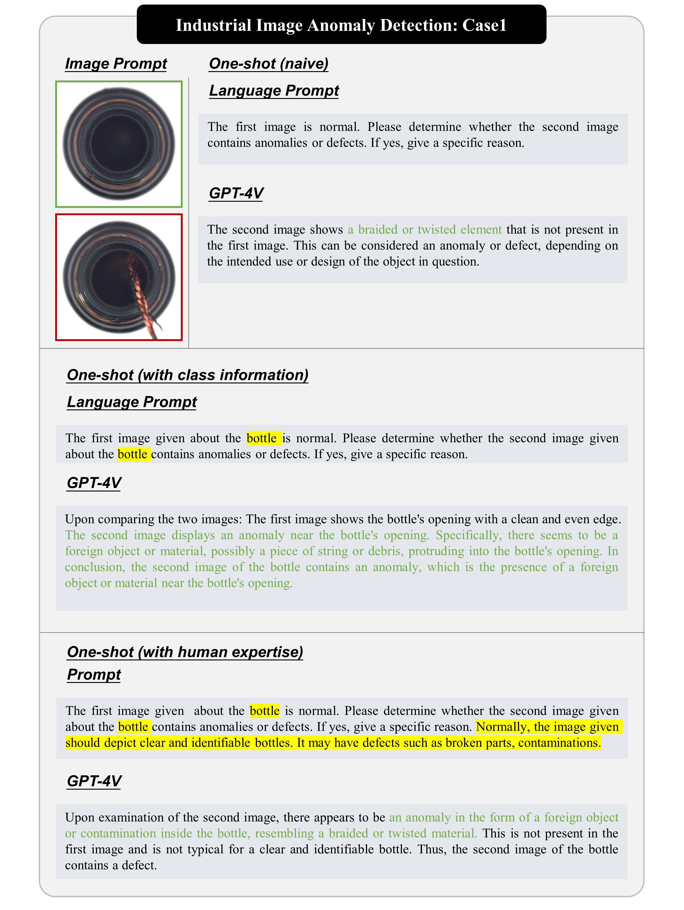
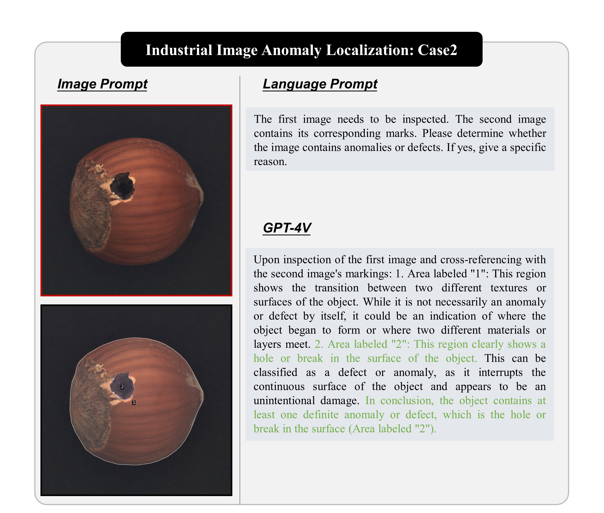

  

# Revolutionizing Generic Anomaly Detection: GPT-4V Takes the Lead

📃 [Read the Full Paper](https://arxiv.org/pdf/2311.02782)

Yunkang Cao*, Xiaohao Xu*, Chen Sun*, Xiaonan Huang, Weiming Shen.
(*These authors contribute equally.)

---

## Table of Contents

- [Introduction](#introduction)
- [Observations](#observations)
- [GPT-4V for Generic Anomaly Detection](#gpt-4v-for-generic-anomaly-detection)
- [Citation](#citation)
- [Acknowledgments](#acknowledgments)

---

## Introduction

Anomaly detection is a crucial task across different domains and data types. However, existing anomaly detection models are often designed for specific domains and modalities. This study explores the use of GPT-4V(ision), a powerful visual-linguistic model, to address anomaly detection tasks in a generic manner. We investigate the application of GPT-4V in multi-modality, multi-domain anomaly detection tasks, including image, video, point cloud, and time series data, across multiple application areas, such as industrial, medical, logical, video, 3D anomaly detection, and localization tasks. To enhance GPT-4V's performance, we incorporate different kinds of additional cues such as class information, human expertise, and reference images as prompts. Based on our experiments, GPT-4V proves to be highly effective in detecting and explaining global and fine-grained semantic patterns in zero/one-shot anomaly detection. This enables accurate differentiation between normal and abnormal instances. Overall, GPT-4V exhibits promising performance in generic anomaly detection and understanding, thus opening up a new avenue for anomaly detection.

**All cases and corresponding prompts for evalutaions can be found in ``./Cases``.**

---

## Observations

GPT-4V demonstrates robust anomaly detection capabilities in various multi-modal and multi-field tasks. It excels in comprehending image context, discerning normal standards, and comparing provided images effectively.

### GPT-4V can address multi-modality and multi-field anomaly detection tasks in zero/one-shot regime

- **Multi-Modality Anomaly Detection**: GPT-4V handles diverse data types like images, point clouds, and X-rays, making it adaptable to multi-modal tasks, surpassing single-modal detectors.

- **Multi-Field Anomaly Detection**: GPT-4V performs well in industrial, medical, pedestrian, traffic, and time series anomaly detection, showcasing its versatility across domains.

- **Zero/One-Shot Anomaly Detection**: GPT-4V adapts to different inference scenarios, utilizing language prompts for anomaly detection, with or without reference images.

### GPT-4V can understand both global and fine-grained semantics for anomaly detection

- **Global Semantics**: GPT-4V recognizes overarching abnormal patterns or behaviors, making it suitable for identifying anomalies in broader contexts, e.g., traffic anomaly detection.

- **Fine-Grained Semantics**: GPT-4V precisely localizes anomalies within complex data, enhancing its ability to detect subtle irregularities, e.g., industrial image anomaly detection.

### GPT-4V can automatically reason for anomaly detection

GPT-4V automatically reasons complex normal standards and provides explanations for detected anomalies. It adds interpretability to its results, making it valuable for understanding irregularities in various domains.

### GPT-4V can be enhanced with increasing prompts

Additional prompts improve GPT-4V's anomaly detection performance, responding to class information, human expertise, and reference images.

### GPT-4V can be constrained in real-world application but still promising

While GPT-4V shows promise, challenges exist in highly complex scenarios, such as industrial applications and ethical constraints in the medical field. Further enhancements and fine-tuning may be required to address these challenges and unlock its potential.

---

## GPT-4V for Generic Anomaly Detection

### Industrial Image Anomaly Detection

**Task Introduction**: Industrial image anomaly detection is a critical component of manufacturing processes aimed at upholding product quality. Following the establishment of the MVTec AD dataset, various methods have thrived in this field. 

### Industrial Image Anomaly Localization

**Task Introduction**: Industrial image anomaly localization entails a more intricate process than mere image anomaly detection. Its potential for image anomaly localization warrants further exploration.

<!-- Add descriptions and images for other tasks -->

---

### Citation

If you found this study useful in your research or applications, please kindly cite using the following BibTeX:

@article{cao2023genericad,
title={Towards Generic Anomaly Detection and Understanding: Large-scale Visual-linguistic Model (GPT-4V) Takes the Lead},
author={{Yunkang Cao and Xiaohao Xu and Chen Sun and Xiaonan Huang and Weiming Shen},
journal={arXiv preprint arXiv:2311.02782},
year={2023}
}

---

### Acknowledgments

Our study is largely inspired by [GPT-4V](http://arxiv.org/abs/2309.17421), [GPT-4V for Medical](http://arxiv.org/abs/2310.09909), [SoM](http://arxiv.org/abs/2310.11441), [CPMF](https://arxiv.org/abs/2303.13194). Thanks for their wonderful work!

